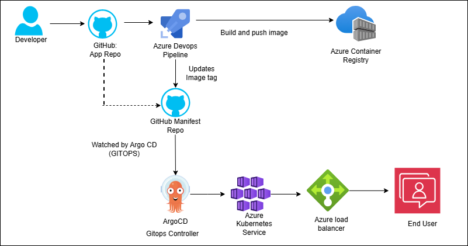
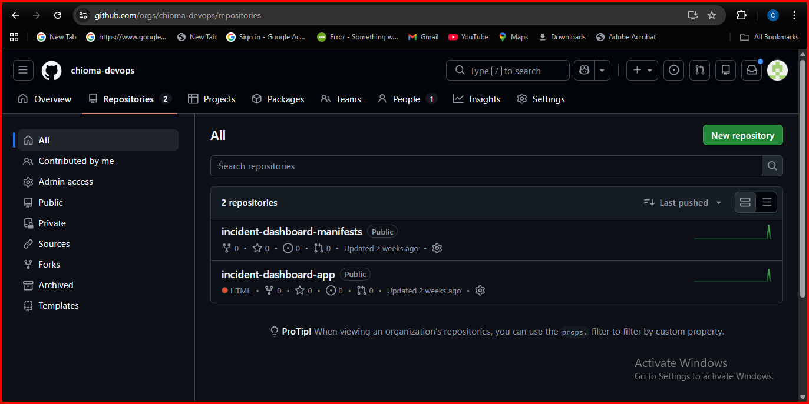
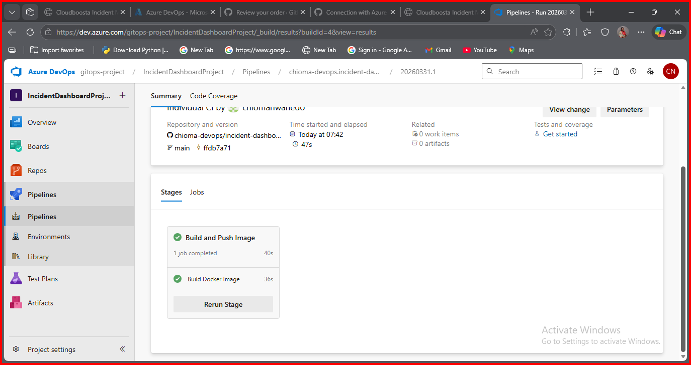
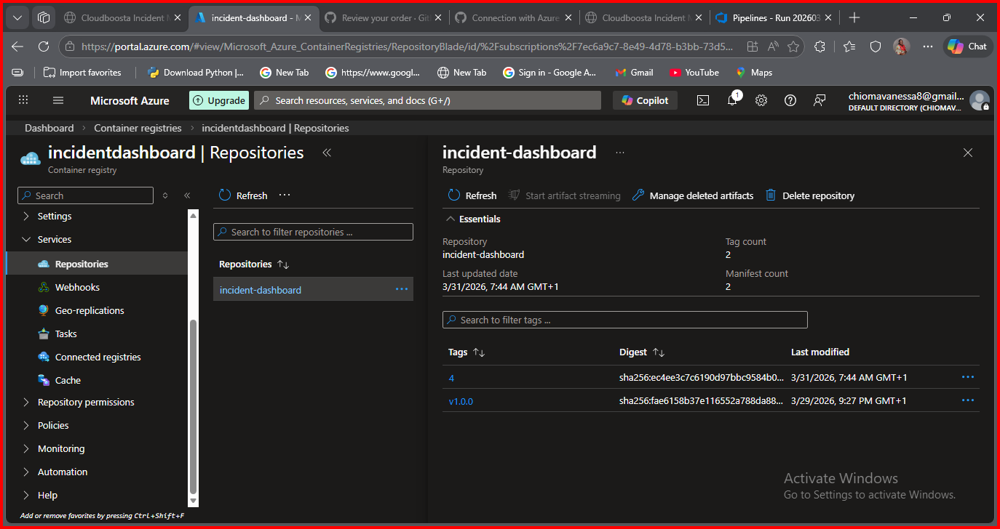
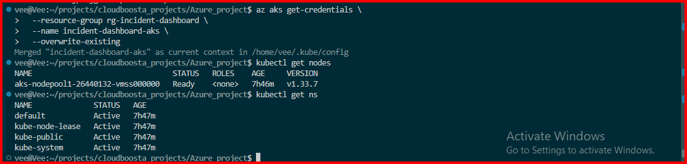
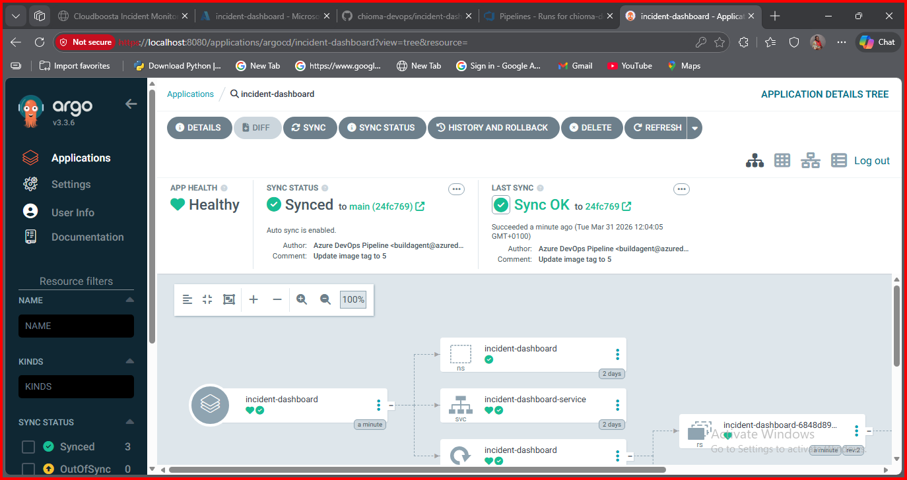
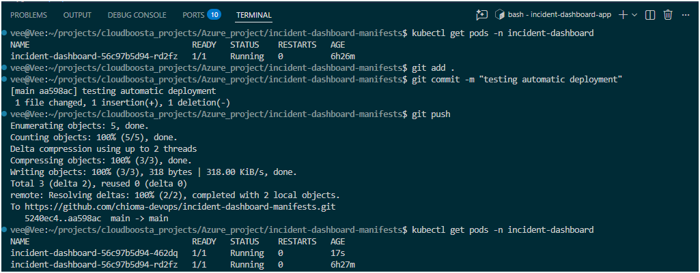
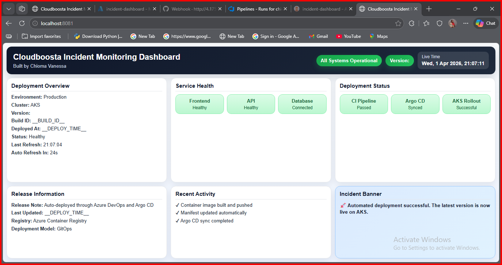
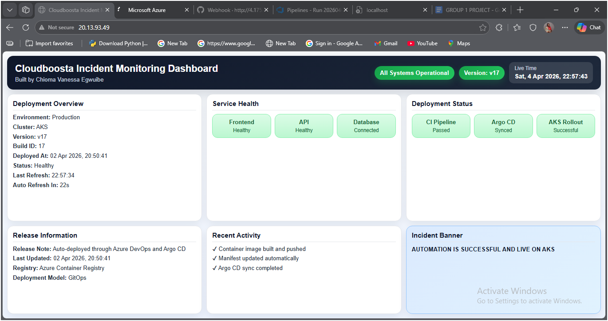
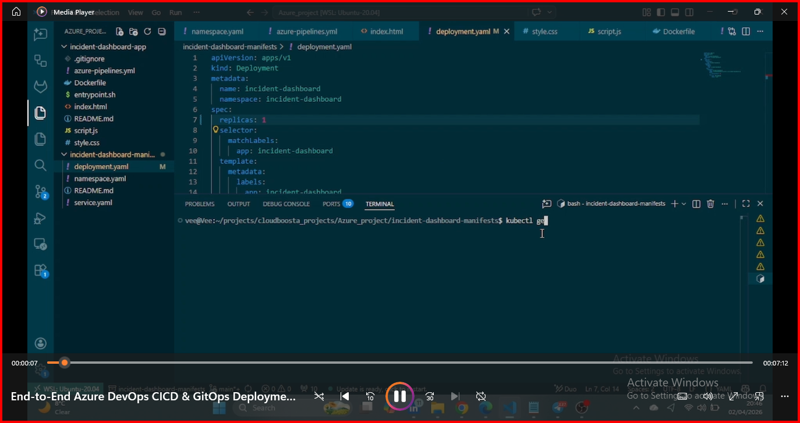

## Incident Dashboard Deployment using CI/CD & GitOps (Azure DevOps, AKS, ACR & Argo CD).

## Author
**Chioma Vanessa Egwuibe**  
DevOps Engineer | Cloud Engineer

---

## Project Overview

This project demonstrates an end-to-end **CI/CD and GitOps workflow** for deploying a containerised application to Azure Kubernetes Service (AKS).

It implements a fully automated deployment pipeline where code changes trigger build, containerisation, image storage, and continuous delivery using GitOps principles.

**Code Change → Build → Push → Deploy → Live Update**

---

## Architecture Overview



*High-level architecture showing Azure DevOps handling CI, Azure Container Registry storing images, and Argo CD managing deployment to AKS using a GitOps approach.*

---

## Workflow Summary

* Developer pushes code to GitHub  
* Azure DevOps pipeline is triggered  
* Docker image is built and pushed to Azure Container Registry (ACR)  
* Pipeline updates the Kubernetes manifests repository with the new image tag  
* Argo CD detects changes in the manifests repository  
* Argo CD synchronises and deploys the application to AKS  
* Application updates are reflected automatically without manual intervention  

---

## Tools & Technologies

* **Cloud Platform:** Microsoft Azure  
* **Container Orchestration:** Kubernetes (AKS)  
* **CI/CD Pipeline:** Azure DevOps  
* **GitOps Tool:** Argo CD  
* **Container Registry:** Azure Container Registry (ACR)  
* **Version Control:** GitHub  
* **Containerisation:** Docker  

---

## Project Structure

### 🔹 Application Repository

```
incident-dashboard-app/
├── Dockerfile
├── azure-pipelines.yml
├── entrypoint.sh
├── index.html
├── script.js
├── style.css
└── README.md
└──Report.md
```

### 🔹 Manifests Repository

```
incident-dashboard-manifests/
├── deployment.yaml
├── service.yaml
├── namespace.yaml
└── 
```

---

## Docker Configuration

```dockerfile
FROM nginx:alpine

COPY index.html /usr/share/nginx/html/index.html
COPY style.css /usr/share/nginx/html/style.css
COPY script.js /usr/share/nginx/html/script.js

COPY entrypoint.sh /entrypoint.sh
RUN chmod +x /entrypoint.sh

EXPOSE 80

CMD ["/entrypoint.sh"]

---

## CI/CD Pipeline (Azure DevOps)

### Source Code Repository



*Application source code and pipeline configuration stored in GitHub, acting as the trigger for CI/CD.*

---

### Pipeline Execution



*Azure DevOps pipeline execution showing automated build and push of the container image to Azure Container Registry.*

---

### Container Registry (ACR)



*Azure Container Registry displaying versioned application images generated by the pipeline.*

---

## Pipeline Key Steps

* Triggered on push to `main` branch  
* Builds Docker image  
* Pushes image to ACR  
* Updates Kubernetes manifest with new image tag  

```yaml
- task: Docker@2
  inputs:
    containerRegistry: 'incidentdashboard-acr-docker'
    repository: 'incident-dashboard'
    command: 'buildAndPush'
    Dockerfile: '**/Dockerfile'
    tags: |
      $(Build.BuildId)
```

### Manifest Update

```bash
sed -i "s|image:.*|image: incidentdashboard.azurecr.io/incident-dashboard:$(Build.BuildId)|" deployment.yaml
```

---

## Kubernetes Deployment (AKS)

### Cluster Verification



*Verification of AKS cluster connectivity and node readiness using kubectl.*

---

### Deployment Configuration

```yaml
apiVersion: apps/v1
kind: Deployment
metadata:
  name: incident-dashboard
spec:
  replicas: 1
  selector:
    matchLabels:
      app: incident-dashboard
  template:
    metadata:
      labels:
        app: incident-dashboard
    spec:
      containers:
      - name: incident-dashboard
        image: incidentdashboard.azurecr.io/incident-dashboard:<tag>
        ports:
        - containerPort: 3000
```

---

## GitOps Deployment with Argo CD

### Argo CD Synchronisation



*Argo CD dashboard showing the application in a healthy and synced state.*

---

### GitOps Trigger



*Git commit updating the manifests repository, triggering automated deployment via Argo CD.*

---

## Application Exposure

### Live Application (Version v13)



*Application deployed and accessible.*

---

### Continuous Deployment (Version v17)



*Updated version automatically deployed via GitOps workflow, demonstrating continuous delivery.*

---

## Video Demonstration

[](https://youtu.be/RCwndCRkN7g)

---

## Key Skills Demonstrated

* Designing and implementing CI/CD pipelines using Azure DevOps  
* Building and managing containerised applications with Docker  
* Deploying and managing workloads on Kubernetes (AKS)  
* Implementing GitOps workflows using Argo CD  
* Automating deployment pipelines and reducing manual processes  

---

## Key Outcome

This project demonstrates a production-style **CI/CD and GitOps pipeline**, achieving:

* Fully automated build and deployment workflows  
* Version-controlled infrastructure and deployments  
* Continuous delivery through GitOps (Argo CD)  
* Reduced manual intervention and deployment risk  
* Scalable and reliable application delivery on Kubernetes  

---

## Project Repository

**Application Repo:**  
https://github.com/chioma-devops/incident-dashboard-app.git  

**Manifests Repo:**  
https://github.com/chioma-devops/incident-dashboard-manifests.git  